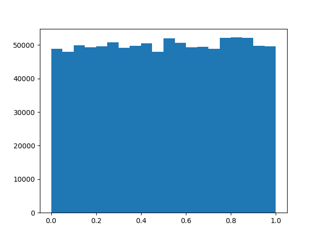

```python
import generator

a = 134279
r0 = 1
m = 337109
n = 1000000
```


```python
print("change values y/n?")
choose = input()
if "y" in choose:
    print("input A")
    a = int(input())
    print("input R0")
    r0 = int(input())
    print("input M")
    m = int(input())
```

    change values y/n?
    n
    


```python
histn = 20
    
step = 1 / float(20)
res = generator.gen_list(m, a, r0, n)
x__mean = generator.mat_ozh(res)
d = generator.disp(res, x__mean)
period = generator.period_length(m, a, r0, 1000000)
print("matozh = ", x__mean)
print("disp = ", d)
print("SKO = ", generator.sqrt(d))
print("K = ", generator.k_res(res))
print("period = ", period)
print("aperiod = ", generator.aperiod_length(period, res))
```

    matozh =  0.5033018491911083
    disp =  0.08304274940974542
    SKO =  0.2881713889506476
    K =  0.22137
    period =  13984
    aperiod =  13984
    


```python
generator.showHist(res)
```


## generator histogram



```python
import math
n = 22

m = n / float((2 * math.log(n)) + (math.log(math.log(n))))
print("m = ", str(m))
```

    m =  3.009331675874369
    
